# DynamicsMLP Architecture (PyTorch ResNet)

Here is a visual representation of the neural network we just trained to predict the double pendulum's chaotic dynamics. 

It takes in the 8 state variables, normalizes them, passes them through a wide 256-neuron input layer, pushes that signal through three identical **Residual Blocks** (which give it the "ResNet" name), and outputs the 4 predicted *changes* (residuals) to the system state!

```mermaid
graph TD
    %% Input Layer
    subgraph Inputs
        I1["m1"]
        I2["m2"]
        I3["l1"]
        I4["l2"]
        I5["theta1"]
        I6["theta2"]
        I7["omega1"]
        I8["omega2"]
    end
    
    %% Input Processing
    Norm["Standard Scaler Normalization"]
    InputLinear["Linear Layer (8 → 256)"]
    InputReLU["ReLU Activation"]
    
    Inputs --> Norm
    Norm --> InputLinear
    InputLinear --> InputReLU
    
    %% Residual Block 1
    subgraph ResBlock1["Residual Block 1"]
        L1_1["Linear (256 → 256)"]
        LN1_1["LayerNorm"]
        R1_1["ReLU"]
        L1_2["Linear (256 → 256)"]
        LN1_2["LayerNorm"]
        Add1((+))
        R1_2["ReLU"]
        
        L1_1 --> LN1_1 --> R1_1 --> L1_2 --> LN1_2
    end
    
    %% Residual Block 2
    subgraph ResBlock2["Residual Block 2"]
        L2_1["Linear (256 → 256)"]
        LN2_1["LayerNorm"]
        R2_1["ReLU"]
        L2_2["Linear (256 → 256)"]
        LN2_2["LayerNorm"]
        Add2((+))
        R2_2["ReLU"]
        
        L2_1 --> LN2_1 --> R2_1 --> L2_2 --> LN2_2
    end
    
    %% Residual Block 3
    subgraph ResBlock3["Residual Block 3"]
        L3_1["Linear (256 → 256)"]
        LN3_1["LayerNorm"]
        R3_1["ReLU"]
        L3_2["Linear (256 → 256)"]
        LN3_2["LayerNorm"]
        Add3((+))
        R3_2["ReLU"]
        
        L3_1 --> LN3_1 --> R3_1 --> L3_2 --> LN3_2
    end
    
    %% Output Layer
    OutputLinear["Linear Layer (256 → 4)"]
    Denorm["Standard Scaler Denormalization"]
    
    subgraph Outputs["Output Residuals"]
        O1["d_theta1"]
        O2["d_theta2"]
        O3["d_omega1"]
        O4["d_omega2"]
    end
    
    %% Connections
    InputReLU --> L1_1
    InputReLU --> Add1
    LN1_2 --> Add1
    Add1 --> R1_2
    
    R1_2 --> L2_1
    R1_2 --> Add2
    LN2_2 --> Add2
    Add2 --> R2_2
    
    R2_2 --> L3_1
    R2_2 --> Add3
    LN3_2 --> Add3
    Add3 --> R3_2
    
    R3_2 --> OutputLinear
    OutputLinear --> Denorm
    Denorm --> Outputs
    
    classDef block fill:#f9f9f9,stroke:#333,stroke-width:2px;
    class ResBlock1,ResBlock2,ResBlock3 block;
```

